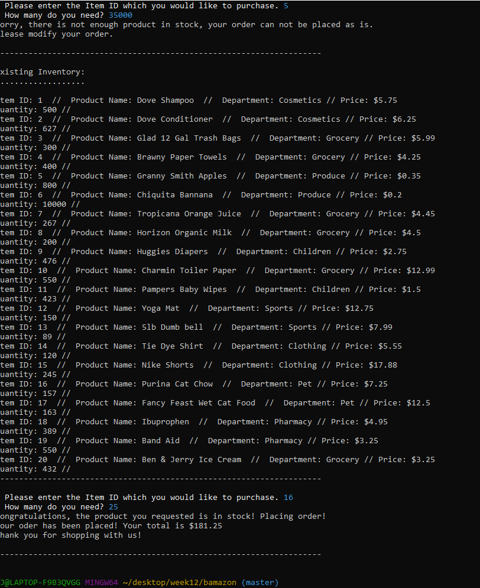

# Bamazon
In this App I am practicing skills learned with MySQL and inquirer. The idea is a command line "Amazon" like app allowing you to see a list of items, choose an item, and then you can purchase however many you would like assuming they are in stock.
Once you have the files downloaded you will need to navigate your terminal to the directory where you saved the files.
Once completed type ''' node server.js```
You should then get a screen that looks like this.

You may then select an item by its ID and you may then choose how many you wish to purchase.
If you try to purchase to much of an item you will get a screen that looks like this.


To exit the APP press CTRL + C
